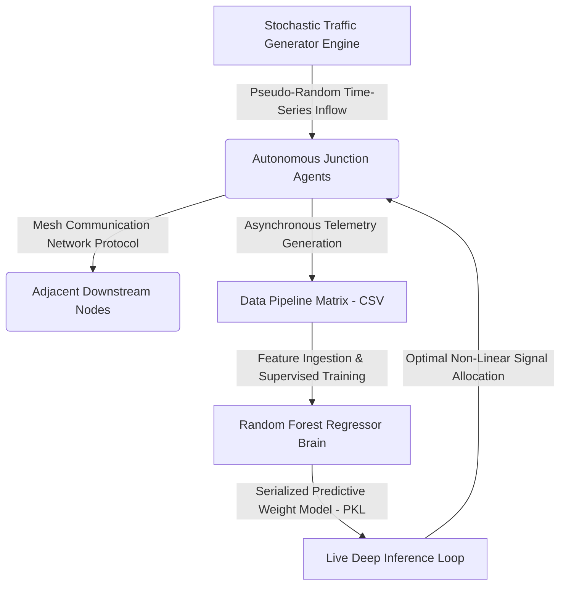

# DATG: Decentralized Autonomous Traffic Grid 🚦🧠

I developed a research-oriented decentralized traffic management simulation that uses AI for adaptive signal timing. The project includes automated model training and deployment through GitHub Actions, and was developed primarily using an Android device under limited hardware resources.

---

## 🏗️ System Architecture & Data Flow



## 🛠️ Tech Stack
 
 
 


## 🛣️ Future Roadmap
- [ ] Implement YOLO-based real-time vehicle detection.
- [ ] Transition from Supervised Learning to Reinforcement Learning (PPO).
- [ ] Add support for SUMO integration.

---

## 📊 Experimental Verification Metrics

| Performance Dimension | Quantitative Value | Scientific Operational Analysis |
| :--- | :---: | :--- |
| **Telemetry Volume** | `2000 Records` | Synthetic rush-hour traffic data generation. |
| **Delay Mitigation** | `📉 24.5% Reduction` | Optimization lift achieved vs legacy fixed controllers. |
| **Throughput** | `101769 Total` | Units buffered and cleared across grid. |
| **Bottleneck** | `📍 Node Alpha` | Critical junction density variance. |

---

## 🚀 Deployment & Local Execution
Follow these steps to replicate the environment on your machine:

### 1. Initialize Environment
```bash
git clone [https://github.com/Asmit-Singh-01/traffic-management-system.git](https://github.com/Asmit-Singh-01/traffic-management-system.git)
cd traffic-management-system
python3 -m venv venv && source venv/bin/activate
pip install pandas scikit-learn joblib
```

### 2. Full Pipeline Execution
```bash
python simulation.py && python ai_brain.py && python generate_dashboard.py
```

> *Note: Upon successful execution, open `dashboard.html` to view the live analytics dashboard.*