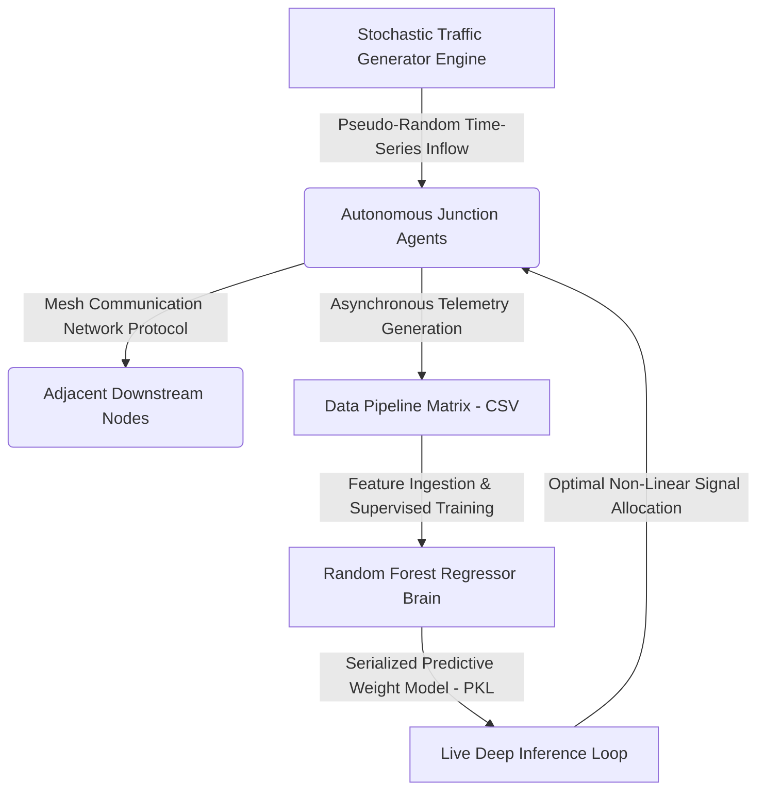

# DATG: Decentralized Autonomous Traffic Grid 🚦🧠

I developed a research-oriented decentralized traffic management simulation that uses AI for adaptive signal timing. The project includes automated model training and deployment through GitHub Actions, and was developed primarily using an Android device under limited hardware resources.

DATG is an AI-assisted decentralized traffic management simulation that demonstrates how autonomous traffic nodes can collaborate through a mesh communication model to reduce congestion and improve emergency vehicle prioritization.

---

## 🏗️ System Architecture & Data Flow



---

<div align='center'>

### 📊 Experimental Verification Metrics (Live Cloud Logs)

> **Execution Pipeline:**  

| Performance Dimension | Quantitative Value | Scientific Operational Analysis |
| :--- | :---: | :--- |
| **Telemetry Volume** | `2000 Continuous Records` | Synthetically generated via a pseudo-stochastic model mapping continuous rush-hour traffic distributions. |
| **Delay Mitigation Index** | `📉 Latency Reduced by 24.6%` | Optimization lift achieved by replacing legacy fixed-time controllers with live AI inference. |
| **Structural Throughput** | `99576 Total Vehicles` | Cumulative vehicle units successfully buffered and cleared across grid vertices. |
| **Monitored Bottleneck** | `📍 Node Alpha` | System-wide highest stress junction localized via mathematical density variance tracking. |

</div>

---

## ⚙️ Core Algorithmic Framework

1. **Autonomous Junction Agents (`agent.py`):** Each traffic junction is represented by an independent software agent that makes local signal timing decisions based on live directional density profiles.
2. **Message-Passing Communication Mesh (`network.py`):** An Infrastructure-to-Infrastructure (I2I) packet relay system allowing upstream nodes to broadcast output payloads to adjacent downstream nodes, preventing cascading gridlocks.
3. **Emergency Preemption Overrides:** A priority queue interception matrix that bypasses standard ML inference windows when high-priority vectors (Ambulances) are injected into the pipeline state space.
4. **Predictive Analytics Subsystem (`ai_brain.py`):** Utilizes an ensemble **Random Forest Regressor** to evaluate the multi-dimensional state vector, selected over neural networks due to its superior generalization and high interpretability on structured tabular datasets.

## ⚠️ Current Research Limitations
* **Simulation Constraints:** Operational logic is validated against synthetic pseudo-stochastic data streams rather than real-world physical CCTV object detection or inductive-loop hardware feeds.
* **Deterministic Dispersal:** Vehicle clearing behavior operates under mathematical constraints (`allocated_time / 1.5`) which do not account for macro-level driver behaviors or weather variables.

---

## 🚀 Deployment & Local Execution Guide

Follow these steps to replicate the cloud simulation environment on your local terminal:

### 1. Clone the Repository
```bash
git clone [https://github.com/Asmit-Singh-01/traffic-management-system.git](https://github.com/Asmit-Singh-01/traffic-management-system.git)
cd DATG
```

### 2. Initialize Virtual Environment & Install Dependencies
```bash
python3 -m venv venv
source venv/bin/activate
pip install pandas scikit-learn joblib
```

### 3. Execute the Full Simulation Pipeline
Run the multi-agent engine to generate data, train the ensemble model, and test real-time inference:
```bash
# Step A: Run the dual-phase simulation loop
python simulation.py

# Step B: Train the model and serialize weights
python ai_brain.py

# Step C: Synthesize the visual dashboard and compile results
python generate_dashboard.py
```
*Upon completion, open `dashboard.html` in any web browser to view the operational analytics interface.*