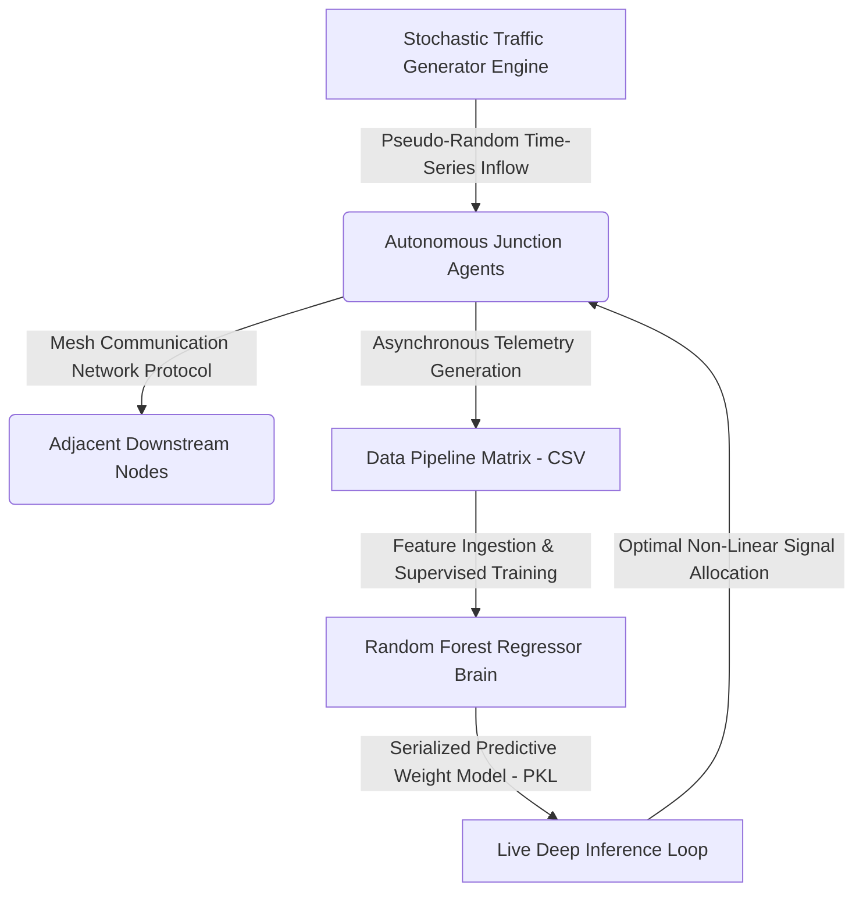

# DATG: Decentralized Autonomous Traffic Grid 🚦🧠

I developed a research-oriented decentralized traffic management simulation that uses AI for adaptive signal timing. The project includes automated model training and deployment through GitHub Actions, and was developed primarily using an Android device under limited hardware resources.

---

## 🏗️ System Architecture & Data Flow



## 🛠️ Tech Stack & Tools
- **Language:** Python 3.x
- **Data Analysis:** Pandas, Scikit-learn
- **Automation/CI/CD:** GitHub Actions
- **Development Environment:** Android (Termux/Acode)
- **Architecture:** Decentralized Mesh Communication

## 🛣️ Future Roadmap
- [ ] Implement YOLO-based real-time vehicle detection.
- [ ] Transition from Supervised Learning to Reinforcement Learning (PPO).
- [ ] Add support for SUMO (Simulation of Urban MObility) integration.

---

<div align='center'>

### 📊 Experimental Verification Metrics (Live Cloud Logs)

> **Execution Pipeline:**  

| Performance Dimension | Quantitative Value | Scientific Operational Analysis |
| :--- | :---: | :--- |
| **Telemetry Volume** | `2000 Continuous Records` | Synthetically generated via a pseudo-stochastic model mapping continuous rush-hour traffic distributions. |
| **Delay Mitigation Index** | `📉 Latency Reduced by 25.3%` | Optimization lift achieved by replacing legacy fixed-time controllers with live AI inference. |
| **Structural Throughput** | `97599 Total Vehicles` | Cumulative vehicle units successfully buffered and cleared across grid vertices. |
| **Monitored Bottleneck** | `📍 Node Alpha` | System-wide highest stress junction localized via mathematical density variance tracking. |

</div>

## 🚀 Deployment & Local Execution Guide
Follow these steps to replicate the cloud simulation environment on your local terminal:

### 1. Clone the Repository
```bash
git clone [https://github.com/Asmit-Singh-01/traffic-management-system.git](https://github.com/Asmit-Singh-01/traffic-management-system.git)
cd traffic-management-system
```

### 2. Initialize Virtual Environment
```bash
python3 -m venv venv
source venv/bin/activate
pip install pandas scikit-learn joblib
```

### 3. Execute Simulation
```bash
python simulation.py
python ai_brain.py
python generate_dashboard.py
```